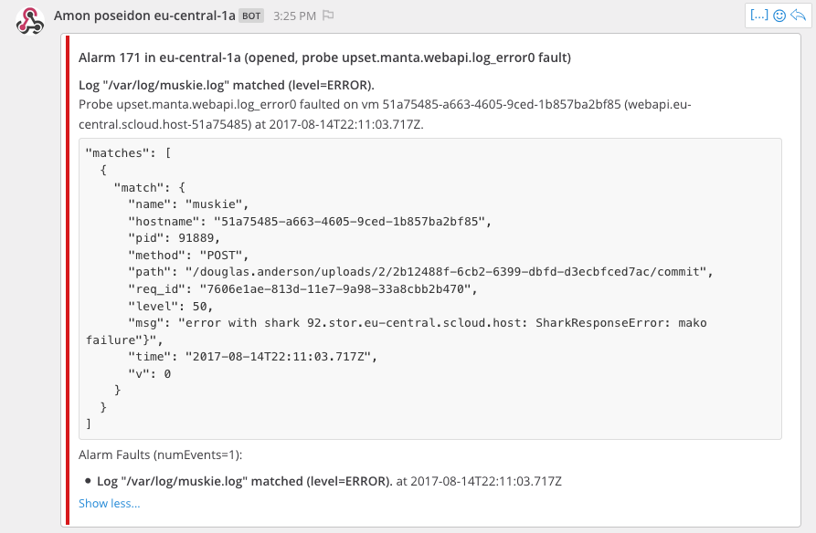
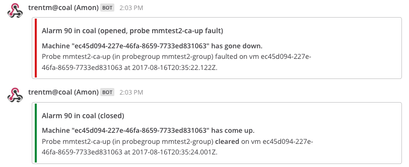
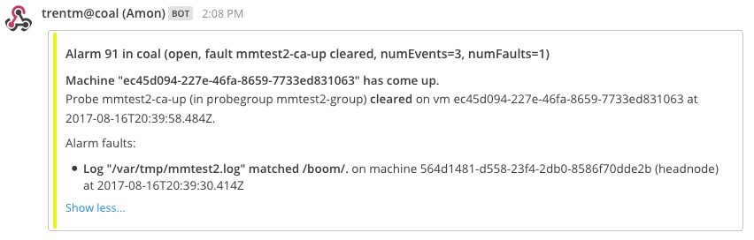

<!--
    This Source Code Form is subject to the terms of the Mozilla Public
    License, v. 2.0. If a copy of the MPL was not distributed with this
    file, You can obtain one at http://mozilla.org/MPL/2.0/.
-->

<!--
    Copyright (c) 2017, Joyent, Inc.
-->

# Amon Design Discussions

Here-in some design discussions for Amon, collected here because they might be
helpful to understand why Amon is the way it is. Each section is dated to give
context if reading this in the future when Amon design might have moved on. *Add
new sections to the top.*

# Amon notifications re-hash (Aug 2017)

I'm adding Mattermost notification support and as part of this I'm revisiting
improving and perhaps sharing the handling of how to format the data for
a notification.

Here is an example (slightly clipped) of the data available when creating a
notification:

```
user: {
  "login": "trentm",
}
alarm: {
  "id": 1,
  "probe": "cfbe1b98-e407-61a6-ab1c-b81863546d97",
  "closed": false,
  "timeOpened": 1502773793346,
  "timeClosed": null,
  "timeLastEvent": 1502773793254,
  "faults": [
    {
      "type": "probe",
      "probe": "cfbe1b98-e407-61a6-ab1c-b81863546d97",
      "event": {
        "v": 1,
        "type": "probe",
        "user": "826d2dd2-6456-4edb-9981-a1c41fe8f48e",
        "probeUuid": "cfbe1b98-e407-61a6-ab1c-b81863546d97",
        "clear": false,
        "data": {
          "message": "Log \"/var/tmp/canary.log\" matched /chirp/.",
          "value": 1,
          "details": {
            "matches": [
              {
                "match": "chirp",
                "context": "chirp"
              }
            ]
          }
        },
        "machine": "564d1481-d558-23f4-2db0-8586f70dde2b",
        "uuid": "eaa0ede9-f052-ccd0-f4ff-ec377a023ae8",
        "time": 1502773793254,
        "agent": "564d1481-d558-23f4-2db0-8586f70dde2b",
        "agentAlias": "headnode"
      }
    }
  ],
  "maintFaults": [],
  "numEvents": 1,
}
--
event: {
  "v": 1,
  "type": "probe",
  "user": "826d2dd2-6456-4edb-9981-a1c41fe8f48e",
  "probeUuid": "cfbe1b98-e407-61a6-ab1c-b81863546d97",
  "clear": false,
  "data": "[Circular]",
  "machine": "564d1481-d558-23f4-2db0-8586f70dde2b",
  "uuid": "eaa0ede9-f052-ccd0-f4ff-ec377a023ae8",
  "time": 1502773793254,
  "agent": "564d1481-d558-23f4-2db0-8586f70dde2b",
  "agentAlias": "headnode",
  "relay": "564d1481-d558-23f4-2db0-8586f70dde2b"
}
--
probe: {
  "user": "826d2dd2-6456-4edb-9981-a1c41fe8f48e",
  "uuid": "cfbe1b98-e407-61a6-ab1c-b81863546d97",
  "dn": "amonprobe=cfbe1b98-e407-61a6-ab1c-b81863546d97, uuid=826d2dd2-6456-4edb-9981-a1c41fe8f48e, ou=users, o=smartdc",
  "raw": {
    "agent": "564d1481-d558-23f4-2db0-8586f70dde2b",
    "config": "{\"path\":\"/var/tmp/canary.log\",\"match\":{\"pattern\":\"chirp\"}}",
    "contact": [
      "localmattermost"
    ],
    "disabled": "false",
    "machine": "564d1481-d558-23f4-2db0-8586f70dde2b",
    "name": "mm-test",
    "objectclass": "amonprobe",
    "type": "log-scan",
    "user": "826d2dd2-6456-4edb-9981-a1c41fe8f48e",
    "uuid": "cfbe1b98-e407-61a6-ab1c-b81863546d97",
    "groupEvents": false
  },
  "name": "mm-test",
  "type": "log-scan",
  "agent": "564d1481-d558-23f4-2db0-8586f70dde2b",
  "machine": "564d1481-d558-23f4-2db0-8586f70dde2b",
  "contacts": "[Circular]",
  "config": {
    "path": "/var/tmp/canary.log",
    "match": {
      "pattern": "chirp"
    }
  },
  "groupEvents": false,
  "disabled": false
}
```


Working pseudo-template for the distilled data for sections of a notification:

```
# $from
# e.g.: Amon poseidon us-east-1
Amon $dc $user.login

# $color
- green if alarm is closed
- yellow if event.clear
- otherwise, red

# $title
# Notification title is about the alarm: id, current status, reason for
# notification.
#
# $action:
# - "closed" if alarm.closed;
# - "opened, probe $probe.name fault" if this is the first event
# - "probe $probe.name cleared" if event.clear
# - "new probe $probe.name fault" (does this also work with probe groups?)
# - error note if unexpected state
#
# $numEvents: Include this is there is >1 event.
# $numFaults: Include this is there is >1 fault. Else it is typically always 1.
#
Alarm 1 in coal ($action, numEvents=$numEvents, numFaults=$numFaults)

# $closed: Include this boolean in summary so notifier can use that for UX.
closed: false

# $body (markdown)
# The event is the thing that (at least in current Amon notifications)
# triggered this notification. Summarize the event.
**Log \"/var/tmp/canary.log\" matched /chirp/.**
Probe $probe.name (in probegroup $probeGroup.name) faulted on server/vm $uuid ($alias) at $time.
    or
Probe $probe.name (in probegroup $probeGroup.name) *cleared* on server/vm $uuid ($alias) at $time.

# code block of event.data.details (eventually could have probe-type-specific
# rendering)
    "matches": [
      {
        "match": "chirp",
        "context": "chirp"
      }
    ]

# Summarize current alarm faults, including maint faults, only if more than
# this one.
Alarm faults (numEvents=$numEvents):
- **Log \"/var/tmp/canary.log\" matched /chirp/.** at $timestamp-for-1502773793254 (*maint*)
```

## Examples

Some examples of notifications from this template, email and Mattermost
renderings:

Note: For email it would be nice to tweak the `Subject` to have threaded for
same Alarm. Even if that means just putting Alarm id in subject and context (the
stuff in parens) at the start of the body.

```
From: "Amon poseidon eu-central-1a" <$emailAddr>
Subject: Alarm 171 in eu-central-1a (opened, probe upset.manta.webapi.log_error0 fault)

**Log "/var/log/muskie.log" matched (level=ERROR).**
Probe upset.manta.webapi.log_error0 faulted on vm 51a75485-a663-4605-9ced-1b857ba2bf85 (webapi.eu-central.scloud.host-51a75485) at 2017-08-14T22:11:03.717Z.

    "matches": [
      {
        "match": {
          "name": "muskie",
          "hostname": "51a75485-a663-4605-9ced-1b857ba2bf85",
          "pid": 91889,
          "method": "POST",
          "path": "/douglas.anderson/uploads/2/2b12488f-6cb2-6399-dbfd-d3ecbfced7ac/commit",
          "req_id": "7606e1ae-813d-11e7-9a98-33a8cbb2b470",
          "level": 50,
          "msg": "error with shark 92.stor.eu-central.scloud.host: SharkResponseError: mako failure:\nHTTP 400\n{\n  \"server\": \"nginx/1.10.2\",\n  \"date\": \"Mon, 14 Aug 2017 22:11:03 GMT\",\n  \"content-type\": \"application/json\",\n  \"content-length\": \"177\",\n  \"connection\": \"close\"\n}\n{\"code\":\"BadRequestError\",\"message\":\"failed to open file /manta/71655770-4a05-6898-b21f-e4cb3ad1e1e7/211e5290-b1f7-cb39-fc2c-a735b4c1a538 for part 3: No such file or directory\"}",
          "time": "2017-08-14T22:11:03.717Z",
          "v": 0
        }
      }
    ]

Alarm Faults (numEvents=1):
- *Log "/var/log/muskie.log" matched (level=ERROR).* at 2017-08-14T22:11:03.717Z
```

In Mattermost macOS desktop client:


Another Mattermost example showing a "machine-up" probe faulting, and then
clearing itself as a VM rebooted:


Another Mattermost example showing a "machine-up" probe clearing, but colored
yellow because the alarm is part of a probe group and there are other current
faults on the alarm:


A current XMPP notification example:

```
eu-central-1a amon

ALARM: probe=upset.manta.marlin_agent.log_error2,server=MSB05755, type=log-scan, id=173 in eu-central-1a
Log "/var/svc/log/smartdc-agent-marlin-agent:default.log" matched /Stopping because process dumped core./.
{
  "matches": [
    {
      "match": "Stopping because process dumped core.",
      "context": "[ Aug 15 22:19:03 Stopping because process dumped core. ]"
    }
  ]
}
```

With the template proposed we'd (eventually) change that to:

```
Amon poseidon eu-central-1a

Alarm 173 eu-central-1a (opened, probe upset.manta.marlin_agent.log_error2 fault)

**Log "/var/svc/log/smartdc-agent-marlin-agent:default.log" matched /Stopping because process dumped core./.**
Probe upset.manta.marlin_agent.log_error2 faulted on server MSB05755 ($uuid) at 2017-08-14T22:11:03.717Z.

    {
      "matches": [
        {
          "match": "Stopping because process dumped core.",
          "context": "[ Aug 15 22:19:03 Stopping because process dumped core. ]"
        }
      ]
    }
```

# amon-agent runtime (circa 2012)

Discussion: <https://xmpp.joyent.com/logs/manta%40groupchat.joyent.com/2012-07-26.html#22:46:27.329541>

DRAM usage for a node process is like 20MB. That sucks for an amon-agent
running in every zone on a compute node. Think 256MB zones... or
128/64/smaller for some. Sucking 20MB is a non-starter there. That means
considering alternatives: Perl, Python, Luvit. Rackspace's luvit agent takes
about 4-5MB
(https://hub.joyent.com/wiki/display/dev/OSCON+2012+Trip+Report#OSCON2012TripReport-Onetinydaemontoharvestyourserverstatistics%28andmore%29%28Rackspace%29).
Mark mentioned Perl/Python perhaps taking 1-2MB.
TODO: investigate those numbers (for *static* builds).

Obviously my (Trent) bias is going to be Python here. Though that *does*
mean a Python build for the SmartOS GZ... which sucks. Better argument
for Perl there.

TODO: Think about scaling issues here.


# contact objectclass in UFDS (20-July-2012)

How do you add a contact entry? In the current design, contacts are fields
on the UFDS sdcPerson entry. That currently means you need to `ldapmodify`
to add those entries.

An Amon monitor has a "contacts" field which is a list of contact names (used
to send notifications), e.g.:

    contacts: ["email", "myWebhook"],

Those string values are just a field name on the "sdcPerson" entry in UFDS.
Currently Amon doesn't provide any API to add/update/remove those field
entries on UFDS. I'm thinking that it should. Cloud API doesn't otherwise
provide an API to tweak the sdcPerson record.

The API would be something like:

    sdc-amon /pub/:account/contacts/       # ListContacts
    sdc-amon /pub/:account/contacts/:name   # GetContact
    sdc-amon /pub/:account/contacts/:name -X PUT ...  # PutContact
    sdc-amon /pub/:account/contacts/:name -X DELETE  # DeleteContact


The contact is just a key/value pair, but Amon needs to know the notification
*type* as well as *address* info. For example "joe@example.com" is the
address, but "email" is the type. The current mechanism for this is to
require that the field name end with the type of a supported notification
type. E.g. "secondaryEmail" ends with "email" so we use the "email"
notification type, "myWebhook" ends with "webhook", ... Admittedly that isn't
very rigorous.

A motivator for just using key/value fields on the sdcPerson as opposed to
having a separate "contact" objectclass was: (a) to use the existing "email"
field on sdcPerson entries (and possibly the "phone" field) and (b)
simplicity.

Now I'm reconsidering. I think the "simplicity" here isn't:

- ListContacts is problematic because there is no solid rule that says which
  sdcPerson fields are contacts and which not
- The rule to have the notification type in the contact name is lame.
- No obvious way to have a "this is a verified email" flag on a particular
  email.
- Using the existing "email" field on sdcPerson could easily be special cased.
- For complex notification types that require a few pieces of information
  (e.g. a twilio one that needs an API token or whatever): we'd have to
  encode that data into one UFDS value. Not a big deal, but a bit silly.

...

Discussed with this Yunong. We think a separate "objectclass=sdccontact"
that hangs off the sdcPerson entry and *is* replicated to all DCs. An
"sdccontact" will have a "name" field that is unique for that user (allowing
the array of contact names on an "amonmonitor" to be sufficient). `name=email`
will be special cased to use the "email" value on the sdcPerson... because
that is a naturally updated contact field right now.

Why "sdccontact" and not "amoncontact"? It feels general enough that other
parts of SDC *might* want to use this. Currently tho the Amon Master API
will rule these entries. If it *does* become more widely used, then
really should have a separate "Contacts API" or "Notification API" or
whatever that handles (a) updating "sdccontact" entries and (b) perhaps
the sending of notifications.


# maintenance windows (20-Apr-2012)

From the MVP:

1.  Ability for customer to set a maintenance window on a monitor (alert
    suppression for a pre-defined period of time).
2.  Ability for operator to set a maintenance window on a CN and on the whole
    cloud. This would disable alerts to operator.

Scope: Setting a maintenance window only affects processing in the Amon
master. A maintenance window does not stop probe processing, does not stop
creation of alarms. A maintenance window only results in notifications not
being sent during the lifetime of the maintenance window.

See [use case #7](https://mo.joyent.com/docs/amon/master/#7-monitoring-a-multi-machine-webapp)
for a example with which to think about maintenance window support.

Effect of maintenance windows: When the decision (in
`Alarm.prototype.handleEvent`) is being made on whether to notify we check to
see if there is an open maint window affecting this event. (Dev Note: Get all
maint windows for this user from redis and iterate through them: all=true,
monitors match, machine match.) If there is an open maint window, then
do not notify.

When a maint window closes, then check all open alarms:
`alarm.handleMaintenanceEnd`. (Dev Note: we need a timer for closing the
next expiring maint window.) This will potentially send a notification for
that alarm if it results in a change of fault count.

An alarm is said to be "in maintenance" if it is (a) open, (b) has
maintenance faults and (c) has *no* faults not in maintenance. That last
point might be confusing. It can result for a monitor with multiple probes,
where a maintenance window only affects a *subset* of its probes. Alarm "in
maintenance" state should be shown in the portals to show the user that, yes,
there is an alarm here but don't worry about it.


# alarm clearing (2-Apr-2012)

Some alarms can be automatically closed by a probe event (a "clear" event).
This is also called clearing an alarm. For example, a "machine-up" probe
on a machine will send a "clear" event.

Clearing alarms is a little more complicated than just closing the alarm when
an event is attached, because a "clear" is for a particular probe type and
machine, but a monitor can have multiple probes. Therefore an alarm needs to
track the current set of outstanding "faults". A **fault** is a probe
instance that has tripped (is in a fail state).

An alarm will maintain a set of current outstanding faults. On receiving a
"clear" event, if the last outstanding fault is removed, then the alarm
will be closed.


# alarm re-notification (Apr-2012)

When a probe event reaches the master, logic decides whether to create a
new alarm for this event or use an existing one. If the latter, then we
need to decide whether to notify the contacts for this monitor again.
Here are some notes on potential work to do for this. See
`Alarm.prototype.handleEvent` in "master/lib/alarms.js" for the current
state.

    There is the first notify, on alarm creation.
    - Modulo "delay" on first notification for transient errors. See
      zabbix and nagios options below.
      "[x] Don't notify on transient error.  Period: [  60] seconds."

    Subsequent events on the same alarm:
    - Dumbest is to notify every time.
    - Notify no more than once per N minutes.
    - Notify every five minutes regardless of additional events.
    - Notify again if higher severity event.
    - ...
    - Zabbix escalation? Don't go there.
    - http://www.zabbix.com/wiki/howto/config/alerts/delaying_notifications
      Nagios "soft states".
      Delay first notification for transient problems. Would NOT want
      for a reboot, but perhaps for a disk size threshold.

    TODO: Email to ops (linda, ben) on what kind of notification and
      re-notification setup they use in prod. If there is anything they'd
      prefer to see. E.g. for repeated failures of a particular
      check/monitor.

    These are attributes of the monitor. What about default? On the user?

    Implementation. How to handle scheduling and reliable
    sending of notifications?
    - put them in redis, have a interval that checks every N seconds for
      a notification to send (perhaps with a .kick() to send right away)
    - actually want to setup a ping for the alarm to see about notifying.
      So an alarm could handle this itself with setTimeout. If it is to
      be delayed, then it is up to that Alarm instance to put it in redis
      in case of restarts.

    So not `alarm.notify(...)` but `alarm.start()`. Is it too much to have
    an alarm in memory the whole time? Yes. So not managed by each alarm
    instance.

    Could it be "active alarms"? I.e. reminder notifications time out
    if not new events on an alarm. Or just not support reminder
    notifications (for now). Punt on "delay for transient" failure for now
    too. That means no timer needed.


# webhook contact (30-Mar-2012)

This discussion stems from <https://devhub.joyent.com/jira/browse/MON-97>

First a discussion of using webhook contacts (notification types) with the
current Amon design that all contact info lives as fields on the UFDS
sdcPerson entry.


## scenario A

Machines in two datacenters. Want all your monitors (you have 10)
to hit your issue tracker webhook (or PagerDuty or whatever):
<https://issues.example.com/collect>. Call it "issuesWebhook", i.e. there
is a "issuesWebhook: https://issues.example.com/collect" entry on your
"sdcPerson" in UFDS.

You have another webhook endpoint that you want one monitor to hit (you are
playing with this new monitor and hook). Your play webhook is about
collecting stats. You'd need to create a "statsWebhook" (or whatever name
ending in "webhook", case insensitive) on your user account, then put
"statsWebhook" in the monitor "contacts" array.

What would the UI look like for this? Click "Add a Monitor" or
"Edit Monitor" button to add this contact. The "Edit Monitor" UI shows a
listbox with current contacts:

    Name:       [mymonitor       ]

    Contacts:
    +--------------------------------------------+
    | email: trentm@gmail.com (email)            |
    |                                            |
    |                                            |
    +--------------------------------------------+
    <Add...> <Edit...> <Remove...>

Clicking "Add..." would pop up a modal dialog (or a separate page, or a
sheet):

    -------- Add a monitor contact --------

    **Use an existing contact:**

    Contact:    [ ] email: trentm@gmail.com (email)
                [ ] email: trent.mick@joyent.com (secondaryEmail)
                [ ] webhook: https://issues.example.com/collect (issuesWebhook)

    <<Use Selected Contacts>>


    **Or create a new contact:**

    Type:       [ webhook   [v]]               <---- menulist
    Name:       [ stats        ]               <---- text field
    URL:        [ http://user@pass:stats.example.com/collect ]

    <<Create and select this contact>>

If using the "Or create a new contact" option, this would add a "statsWebhook"
field on the UFDS sdcPerson, then add that new contact to mymonitor's list.

Pros:
- centralized contact info allows re-use in separate data centers
- centralized contact info allows one to update, e.g. your email, *once*
  and have that take effect for all your Amon monitors
- Having the contact info on the sdcPerson means that Amon naturally uses
  the "email" field already managed there. Perhaps this will also be true
  for an existing phone number field for SMS notifications.

Cons:
- Having to specify a "Name:" for a new contact is a bit surprising to the
  user. Also, realistically that name has to be restricted to no spaces
  (and no funny chars) to enable using it as an ldap field.


## put webhook contact info on the monitor

Let's explore a design change in allowing contact info to be on the monitor,
for webhooks at least as currently expressed in
<https://devhub.joyent.com/jira/browse/MON-97>

You'd have a monitor something like this:

    {
        "name": "mymonitor",
        "contacts": [
            "email",
            {
                "type": "webhook",
                "url": "http://stats.example.com/collect"
            }
        ]
    }

Pros:
- You don't have to name the contact.
- Useful for one-offs. I.e. just trying something out.

Cons:
- We'd still want the "centrally named contacts" to support re-use of contacts.
  You wouldn't want to have to repeat that webhook URL for each of your
  100 monitors. This is a "con" then, because we'd have a "second way" to
  do it. This would imply some changes to the UI I mocked up above:
  separating the actions of adding named contacts (we'd want a "Manage
  Contacts" UI anyway) and selecting contacts for a monitor. Perhaps that
  wouldn't be so bad.
